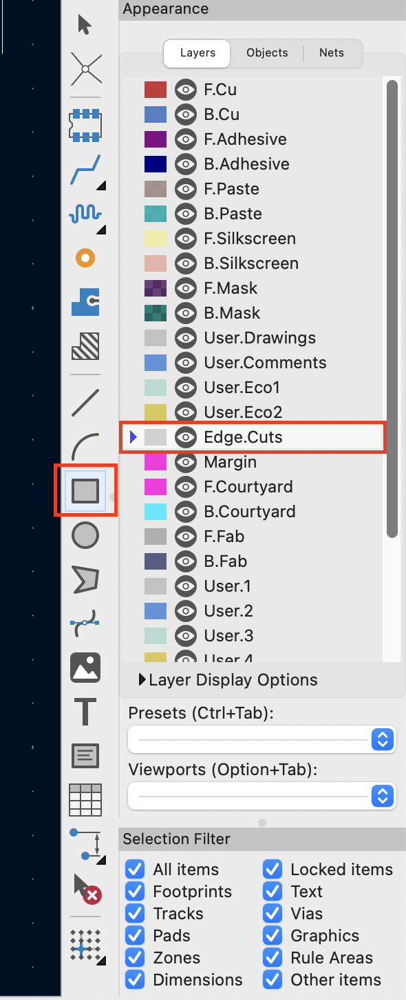
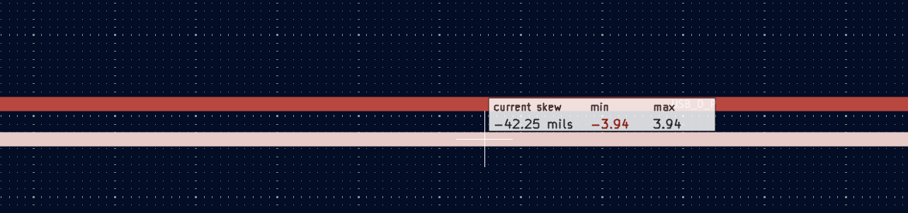

# ESP32-C3 CAD Assignment

This assignment introduces students to microcontroller-based PCB design using the ESP32-C3. By completing this assignment, students will gain hands-on experience with schematic creation, footprint assignment, PCB layout, and firmware programming using KiCad and the Arduino IDE.
Students will develop the necessary skills to:

* Design and create a PCB using standard tools 
* Understand the end-to-end process of PCB development: from schematic design, CAD layout, assembly, and testing.
* Have a PCB that can be used as a reference design for their capstone projects.

## Schematic Guide:

First thing is to download KiCad: https://www.kicad.org
Create a new project called `[netid]_esp32c3DevBoard` and open `[netid]_esp32c3DevBoard.sch`.

### Microcontroller Setup

When designing a PCB with a microcontroller unit (MCU), the best place to start is its datasheet. For this particular assignment, the MCU used will be an ESP32-C3. Its datasheet can be found in the following link.
https://www.espressif.com/sites/default/files/documentation/esp32-c3_datasheet_en.pdf

Hit `a` to open the component add dialog. Search `ESP32-C3` for an ESP32-C3 in an QFN package and click `ok` to place the part.

<figure align="center">
  
  <figcaption>ESP32-C3 Selection</figcaption>
</figure>


While here, add the following components

* Two `Conn_01x04_Pin`. These will be used for GPIO and UART connectors
* `R` for resistors
* `C` for decoupling capacitors. Decoupling capacitors are typically used to filter out noise.
* `GND` for a general ground
  
Use `w` to start routing a new wire under the mouse, left-click to finish routing, and `Esc` to cancel. For a cleaner schematic, use labels to connect pins to the microcontroller. Use `l` to place labels on pins or wires. Any two points with the same label will behave as if connected by a wire. Use `Q` for pins you will leave unconnected.

Begin connecting components using wires as in the picture below. You can change the values of the passive components by hovering your cursor over and double-clicking or pressing `v`. Complete the schematic for the MCU following what is shown:

<figure align="center">
  
</figure>

<figure align="center">
  
</figure>


### USB-C Setup
Add the following components to your schematic to create the USB-C component.

* `USB_C_Receptacle_USB2.0_16P`
* `R`, 2 resistors, they must have the value of `5.1kOhm` to meet USB-C specifications.
The schematic for the USB-C Setup is below. Please make sure that your labels for `D-` and `D+` pins are exactly `USB_D_N` and `USB_D_P` respectively.
<figure align="center">
  
</figure>


### Power Setup
Since the ESP32-C3 operates at `3.3V` we will use a voltage regulator to convert `5V` from the USB-C connection to our desired value. Add the following 

* `AMS1117-3.3`
* `C`, 2 capacitors of with values of `22uF`
<figure align="center">
  
</figure>
The convention to follow when placing components in a block is for power/signal to flow from left to right.


### Motor Controller Setup

* `L293`. This is the motor controller that is being used. Please refer to https://www.ti.com/lit/ds/symlink/l293.pdf for more information.
* `Conn_01x04_Pin`. This connector will contain the output driving signals generated by the L293 IC.
* `R` for a resistor value of `10k Ohms`.
* `Conn_01x02_Pin`. This connector will be an input for a power source to drive the motor.
<figure align="center">
  
</figure>

### Antenna Setup
The ESP32 offers wireless capability,  which requires the use an antenna that resonates at 2.4GHz. Add the following parts, and create the schematic shown below.

* `Antenna`
* `C` for two placeholder capacitors
* `L` for a placeholder inductor
  
<figure align="center">
  
</figure>

The default antenna that you will be using is antenna `AE2`, it is a ceramic chip antenna. However for groups that would like to use an external antenna outside of this assignment, `AE1` may be used instead by soldering a `0402` sized `0 Ohm` resistor. For the best performance, you will want to implement a  matching networking. The matching network we are using is called a `Pi` network. The values for these components should be tuned for optimal performance, and that requires more rigorous testing and experimentation. For this board we will simply use a `0 ohm` jumper resistor instead of the inductor `L1` to complete the electrical connection between the `LNA_IN` on the MCU and the `AE2`. This is not optimal and there is room for improvement, but it works. If your use case requires stronger wireless capability, it is best practice to include a placeholder matching network and then measure and test which values for your capacitors and inductors will work best.

### Bootstrapping Pins and Reset Button
Add the following parts for this portion:

* Two `SW_Push`
* `R` for three pull up resistors with values `10kOhm`. 
* `C` for two `1uF` capacitors
  
The final schematic should look like this:

<figure align="center">
  
</figure>

The buttons define the boot modes and reset conditions for the ESP32. A `bootmode` refers to the various ways a microcontroller can be configured and initialized, often defined by the physical state of hardware pins. Your firmware must match the specific bootmode that a microcontroller is configured to or else it will not work. A common and unfixable mistake is when a board is designed such that its bootmode pins are permanently configured in an invalid way. Buttons (and switches) to configure your MCU give your design options and flexibility to program, mitigating risk in your PCB designs. Details on the ESP32C3 boot mode can be found on page 29 of its datasheet.

The reset button is implemented with a debouncing circuit to filter out parasitic transitions caused by button presses. A deeper explanation of this is provided under `Peripherals` of the following webpage: https://courses.grainger.illinois.edu/ece445/wiki/#/kicad/index.md

<!-- 
### JTAG/UART Setup
For this board, JTAG and UART will be setup for debugging and programming respectively. Add the following components:
* `Conn_01x04_Pin`
The pins connected from the ESP32C3 can be used as `GPIO` pins. For now, the schematic should look like this:
<figure align="center">
  
</figure> -->

### Crystal Setup
The ESP32 requires a `40MHz` crystal. We will be using the `ECS-400-10-37B2-CKY-TR` crystal. However, this part is not natively found in the KiCAD library. So we will have to import it from online. 

A schematic symbol and footprint can be found on websites such as `www.snapeda.com` or `app.ultralibrarian.com`. Both will work if you do a search for your component. Oftentimes, vendors like Digikey will include a link to a parts model under `EDA/CAD Models` as shown below:
  
<figure align="center">
  
</figure>

You may have to import CAD models for specific component in your teams projects. For this part, the following links will allow you to download a CAD model assuming that they are not deprecated.

* https://www.snapeda.com/parts/ECS-400-10-37B2-CKY-TR/ECS/view-part/?ref=digikey
* https://www.digikey.com/en/products/detail/ecs-inc/ECS-400-10-37B2-CKY-TR/14548829

Make sure to download a `2D Model` for `KiCAD (V6 or later)`.
<figure align="center">
  
</figure>

Once downloaded, open KiCad and in the top toolbar, click on `Symbol Editor`.
<figure align="center">
  
</figure>

From there, search `Device`, left click on it, then go to `File > Import > Symbol`. This should open your file editor, go to the directory where you downloaded the ECAD model and select the file that ends with `.kicad_sym`. This will add the schematic symbol of the crystal to your symbol editor. Make sure to save after this. Your symbol editor should look something like this:

<figure align="center">
  
</figure>
Now you can finish your schematic adding the following components:

* `ECS-400-10-37B2-CKY-TR`
* `C` for 10pF capacitors
  
Your final crystal schematic should look like this
<figure align="center">
  
</figure>

When downloading an external CAD model, you will also need to import its footprint into a library. Click on the footprint editor in the toolbar:

<figure align="center">
  
</figure>

Click `Import > Footprint` and go to your directory where the CAD files for the crystal are located. Select the file with the `.kicad_mod` file extension. This should populate the footprint editor. Save the footprint into its appropriate library (in this case Crystal).

<figure align="center">
  
</figure>

### Mounting Holes:
It is important to add mounting holes to secure your PCB in its respective enclosure. To do so, add four `Mounting Holes` to your schematic.

<figure align="center">
  
</figure>

### Finalizing Schematics:
Before moving on to the next stage, we will clean up and document our schematic. Since screenshots of your schematics will go into your design document, you should put some effort into keeping them neat and easy to read. Use the graphic line tool to divide up your schematic, it is in the righthand toolbar or you can press `i` to draw graphical lines. Use the text tool to label each of these blocks.
<figure align="center">
  
</figure>

<figure align="center">
  
</figure>

### Footprint Assignments
After defining the schematics, it is now time to assign physical footprints to each component. A footprint defines the area where a component will be mounted and soldered onto the board, ensuring proper electrical connections and mechanical attachment. It is a layout of pad, outlines, and markings on a PCB that matches the physical dimensions and pin configuration of a specific electronic component. Click on the footprint assigment tool in the the toolbar:

<figure align="center">
  
</figure>

KiCAD will bring up the footprint association window, containing three panes. The left pane contains the categories of footprints, the middle pane contains your parts that need footprints assigned to them, and the right pane contains available footprints based on your filter options.

We will start with the capacitors. We have 0805 sized capacitors that we will solder by hand, so double-click Capacitor_SMD:C_0805_..._HandSolder. Pay attention to the filter options at the top of the window.
<!-- * `Diode_SMD:D_SOD-923`  -->

Assignment the following components to the rest of the board:

* `RF_Antenna:Johanson_2450AT43F0100`
* `Connector_Coaxial:U.FL_Molex_MCRF_73412-0110_Vertical`
* `Button_Switch_THT:SW_DIP_SPSTx02_Slide_9.78x7.26mm_W7.62mm_P2.54mm`
* `Connector_USB:USB_C_Receptacle_G-Switch_GT-USB-7010ASV`
* `Connector_PinHeader_2.54mm:PinHeader_1x04_P2.54mm_Vertical`
* `Connector_PinHeader_2.54mm:PinHeader_1x02_P2.54mm_Vertical`
* `Inductor_SMD:L_0805_2012Metric`
* `Resistor_SMD:R_0805_2012Metric`
* `Button_Switch_SMD:SW_SPST_B3U-1000P`
* `Package_DFN_QFN:QFN-32-1EP_5x5mm_P0.5mm_EP3.7x3.7mm`
* `Package_TO_SOT_SMD:SOT-223-3_TabPin2`
* `Package_DIP:DIP-16_W7.62mm`
* `Crystal:XTAL_ECS-400-10-37B2-CKY-TR` This is the crystal that you imported from earlier.
*  `MountingHole:MountingHole_3.2mm_M3` for M3 screws to mount your board.

The final assignments should look like this:

<figure align="center">
  
</figure>


## Layout Guide
Now we will switch to the physical layout of the board. From the schematic view, click on the following icon to switch views:

<figure align="center">
  
</figure>

Start by clicking the `Update PCB with changes made to schematic` button and place the footprints somewhere in the middle of the page. If you make changes to your schematic later on, you should use this button.

<figure align="center">
  
</figure>

After initially pulling in footprints from your schematic, it should look something like this:

<figure align="center">
  
</figure>

The blue lines are unrouted nets and indicatew what component pads are going to be connected together. To start, lets define the physical cutout of the PCB. You can do this by drawing a shape with "Edge.Cuts" selected in the toolbar. 

<figure align="center">
  
</figure>

Drawing a shape of size `65mmx55mm`, your layout should look something like this:
<figure align="center">
  
</figure>

To make things a bit easier, we will add a ground plane to the front and back side of our board that will automatically connect all GND nets together for us. Any areas of filled in copper like this are known as zones in KiCAD. We can do so by selecting `F.Cu` and `"Draw Filled Zones"` in the toolbar

<figure align="center">
  
</figure>

Define the front and back ground planes to match the dimensions of your edge cut layer so that your layout looks like this:

<figure align="center">
  
</figure>

Now we can begin sorting the footprints. This is generally where most of the time designing a PCB should be spent. The goal here is to untangle the footprints so that airwires cross as little as possible. This makes routing in the next section simpler and helps to keep traces short. To save some time, below is a suggested layout for your board:
<figure align="center">
  
</figure>

As a note, to rotate a footprint to 45 degrees, go to `Settings> PCB Editor > Editing Options` and change the value in the box labeled "Step for rotate commands" to 45.
<figure align="center">
  
</figure>

Once you have placed all your components, make sure the component references are visible and not obscured by other footprints. You will use these references when populating the board.
## Routing:
The success of your routing is dependent on your project. Typically, traces that are high-speed, high-power, or highly parallel are prone to be more sensitive to layout than slower data lines or GPIO. You should identify and prioritze these first. In this particular board, we have the following critical traces

* `USB 2.0` data lines
* `RF 50 Ohm` trace for a `2.4GHz` antenna
* `40MHz` clock signal
* Power Traces

Most of the time, critical connections often adhere to some sort of standard like USB 2.0. Otherwise, you may find routing specifications for component datasheet.  

To define traces, click the dropdown `Track: ... > Edit pre-defined sizes...` and add track widths for `7, 10, 15, 20, and 25 mils`. These larger tracks are used for the power traces.

Some useful shortcuts in KiCAD that you may use for routing are the following:

* `x` - Add tracks
* `v` - Toggle front/back side of board
* `u` - Select all segments of a track
* `Del` - Delete selected track segments
* `b` - redraw zones (after moving footprints or tracks)
 
#### USB 2.0 Differential Traces
USB 2.0 defines a differential signaling pair, according to standard, the differential trace impedance needs to be `90 Ohm`. You should now define a differential pair with a width of `17mils` and a gap of `8 mils`. The differential impedance is dependent on the geometry of your traces as well as your physical stackup. These dimensions were chosen by using a trace impedance calculator that is available in KiCAD as well as other websites.

<figure align="center">
  
</figure>

`6` initiates the process for routing differential pairs. Draw traces labeled `USB_D_P` and `USB_D_N` from the USB C connector to the ESP32.

Since USB is a differential signal, the physical length of each line should be equal. Given your routing, there may be some physical differences in length. To fix this, skew can be intentionally introduced in your routing. To do so, click on `Tools > Tune Skew of Differential Pair`. Your cursor hovering over the differential pair should indicate how much length mismatch there is:
a
<figure align="center">
  
</figure>

By clicking on one of the traces and bringing your cursor into empty space on the PCB, KiCAD will introduce a skew to make sure that the lengths of each trace are the same.

<figure align="center">
  
</figure>

<!-- #### RF Trace
Select a width of `40mils` and add a track from pin 1 of the microcontroller to the antenna as shown below:

<figure align="center">
  
</figure> -->

### Routing on the Backside
When routing a PCB, you will will need to route traces on the backside of the PCB since you will have traces on the same side that need to cross. To do so, you need two vias, which are electrically connected holes in the PCB. First route a trace on the front copper side, place a via, route a trace on the backside, and place a via again to enter the front side again. The example is shown below: 

<figure align="center">
  
</figure>


Continue routing the rest of the tracks. Use 20 mil tracks when connecting power traces to the regulator, and the regulator to the microcontroller. Otherwise, a `10mil` trace width for GPIO and other trace will be okay.

Before moving on, make sure your trace sizes match the following:

* USB 2.0: `7 mils`
* Power Traces (VDD33, 5V): `25 mils`
* RF Traces: `40mils`

You should also have some spacing between your data traces to mitigate cross talk. Generally, a separation of two to three times the trace width is good rule of thumb to follow.

 
### No Fill Zone
The ceramic antenna requires a no fill zone, where there will be no copper pour when the PCB is manufactured. To define a zone, click on the following in the toolbar.

<figure align="center">
  
</figure>

Use the following settings for the zone:
<figure align="center">
  
</figure>

Define a no fill zone rectangle with dimensions of `10mmx55mm`. It should look like something below:

<figure align="center">
  
</figure>

### Grounding
Press `b` to define a copper pour. This will fill the empty space with copper that acts as a GND signal plane for your circuit. Notice that in certain areas of the board there are discontinuities in the copper fill, resulting in `"copper islands"`. These can be problematic, however, they are easily solved by utilized a stitching via.

<figure align="center">
  
</figure>

<figure align="center">
  
</figure>

Place other stitching GNDs vias through your board to ensure a return path for your components throughout the board. This is a simple and important step! The final board should look something like this:

<figure align="center">
  
</figure>


### Fabrication Outputs
Click `File > Fabrication Outputs > Gerbers .gbr`. Select an output directory, and click `Generate Drill Files` and then `Plot`. This will populate your selected directory with the necessary files that a manufacturer will need to create your board. Zip this folder and submit to your respective manufacturer.


#### Generating Custom Footprints and Symbols. 
Please refer to https://courses.grainger.illinois.edu/ece445/wiki/#/kicad/index?id=appendix if you would like to create custom footprints or symbols.

## Assembly Guide:
To assemble the board, please refer to https://courses.grainger.illinois.edu/ece445/wiki/#/soldering/index?id=soldering for a guide to solder SMD components.

<!-- ### Crystal and MCU Soldering TBD if needed. See what Arne thinks-->


## Firmware Guide:
Download the Arduino IDE:
In settings, copy paste this link into the section labeled `Additional Board Managers URLs` and click `Ok`:
```
https://espressif.github.io/arduino-esp32/package_esp32_index.json
```

<figure align="center">
  
</figure>

In boards manager, install the following package labeld "esp32" by Espressif Systems. At the time of this tutorial, version 3.2.0 was used.
<figure align="center">
  
</figure>

Before uploading a program, make sure your settings match those shown below:
<figure align="center">
  
</figure>

You can change your board by selecting `"Board:" > "ESP32 Arduino (In sketchbook)"` and selecting `"ESP32C3 Dev Module"`
The description under `"Port: "` may vary based on your computer. When plugging in your board into your computer, a new port should pop up, select that board for this program.
`"USB CDC On Boot"` should be enabled. This allows for serial connection over USB with the ESP32.

### Hello World Program
```
void setup() {
  Serial.begin(115200);
  pinMode(LED_BUILTIN, OUTPUT);
  delay(1000);
  Serial.println("ESP32-C3 is alive!");
}

void loop() {
  Serial.println("Hello World!");
  delay(1000);
}
```
Through this guided assignment, you have now been able to design and assemble a custom PCB, congrats! By now you should be able to upload code and use this PCB as a development device for your projects for the semester. 

### Remainder of this Assignment:
Using the L293, write code to control a unipolar stepper motor. How you do so is up to you. 
### Assignment Submission:
Take your KiCad project directory and compress it to a `.zip` file, make sure your filename follows the naming convention `[netid]_[Semester]_[Year].zip`. So if you are in the course in Fall of 2025, your filename would be `[netid]_Fall_2025.zip`. Please submit this on Canvas. 
  