# ESP32-C3 CAD Assignment

Include Purpose of assignment, learning objectives, etc.

## Schematic Guide:
First thing is to download KiCad: https://www.kicad.org
Create a new project called `[netid]_esp32c3DevBoard` and open `[netid]_esp32c3DevBoard.sch`.
### Microcontroller Setup
When designing a PCB with a MCU, the best place to start is its datasheet. There is crucial information regarding the requirements for a MCU to function defined in this documentation. For this particular assignment, it can be found in the following link.
https://www.espressif.com/sites/default/files/documentation/esp32-c3_datasheet_en.pdf

Hit `a` to open the component add dialog. Search "ESP32-C3" for an ESP32-C3 in an QFN package and click "ok" to place the part.

  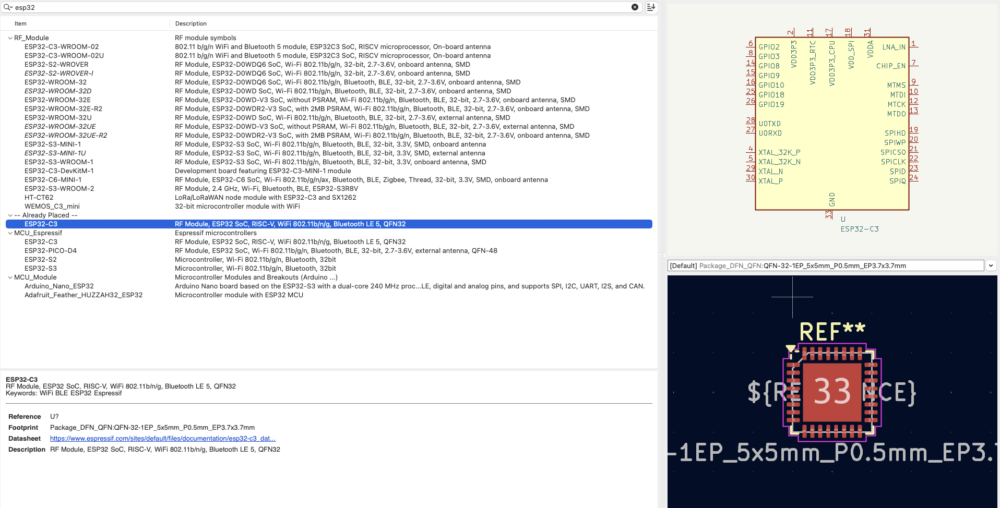

Following the same steps, add the following components
* `Conn_01x04_Pin`
* `Conn_01x02_Pin`
* `R` for resistors
* `C` for capacitors
* `L` for inductors
* `GND` for a general ground
  
Use `w` to start routing a new wire under the mouse, left-click to finish routing, and `Esc` to cancel. For a cleaner schematic, use labels to connect pins to the microcontroller. Use `l` to place labels on pins or wires. Any two points with the same label will behave as if connected by a wire. Use `Q` for pins you will leave unconnected.

Begin connecting components using wires as in the picture below. You can change the values of the passive components by setting your cursor over each and double-clicking or pressing `v`. The labels will be defined for now, and their respective connections will be defined in the following sections.

  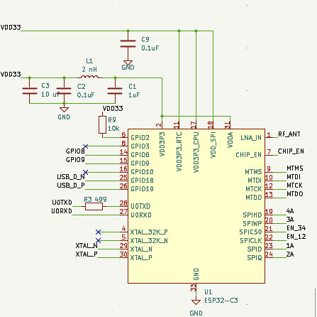

### USB-C Setup
Add the following components to your schematic to create the USB-C component.

* `USB_C_Receptacle_USB2.0_16P`
* `ESD9B5.0ST5G`
* `R`, 2 resistors, they must have the value of `5.1kOhm` to meet USB-C specifications.
The schematic for the USB-C Setup is below. Please make sure that your labels for `D-` and `D+` pins are exactly `USB_D_N` and `USB_D_P` respectively.

  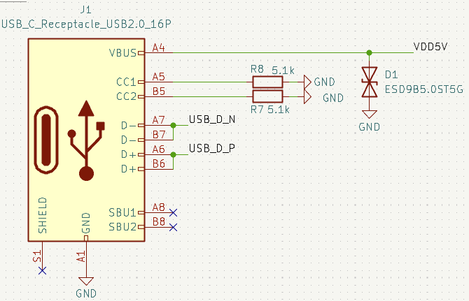

### Power Setup
Since the ESP32-C3 operates at `3.3V` we will use a voltage regulator to convert `5V` from the USB-C connection to our desired value. Add the following 

* `AMS1117-3.3`
* `C`, 2 capacitors of with values of `22uF`

  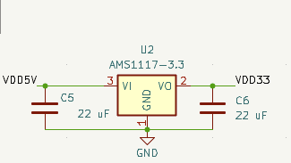

The convention to follow when placing components in a block is for power/signal to flow from left to right.

### Motor Controller Setup

* `L293`. This is the motor controller that is being used.
* `Conn_01x04_Pin`. Thesea are the output driving signals for a motor
* `R` for a resistor value of `0 Ohms`. When assembling your PCB, this can be left open if your motor is operating at `5V`, or it can be connect to an external power source if your motor requires a different voltage level. Please refer the the datasheet for this component for further details. https://www.ti.com/lit/ds/symlink/l293.pdf
* `Conn_01x02_Pin`. This connector will be an input for a voltage source if the resistor is left open, or a test point if a `0 Ohm` resistor is used.

  

### Antenna Setup
The ESP32 offers wireless capability,  which requires the use an antenna that resonates at 2.4GHz. Add the following parts, and create the schematic shown below.

* `Antenna`
* `C` for two `3.2pF` capacitors
* `L` for a `2.2nH` inductor

  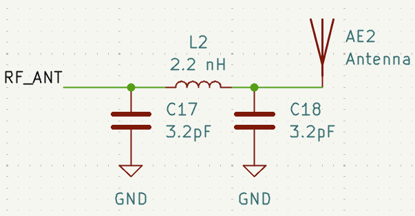

For the best performance, you will want to implement a  matching networking. The network we are using is often called a `Pi` network. The values for these components may be tuned for optimal performance, but that requires more rigorous testing and experimentation. For our purposes we stick with the values shown above.

### Bootstrapping Pins and Reset Button
Add the following parts for this portion:
* `SW_DIP_x02` 
* `SW_Push`
* `R` for three pull up resistors with values `10kOhm`. 
* `C` for a `1uF` capacitor
The final schematic should look like this:

  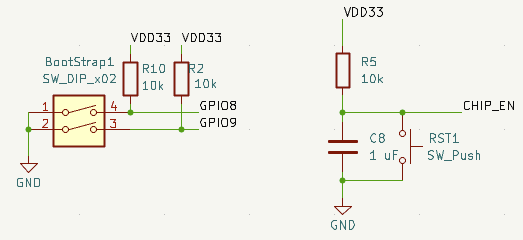

The switches on the left define the boot modes for the ESP32. A 'bootmode' refers to the various ways a microcontroller can be configured and initialized, often defined by the physical state of hardware pins. Your firmware must match the specific bootmode that a microcontroller is configured to or else it will not work. A common and unfixable mistake is when a board is designed such that its bootmode pins are configured in an invalid way. Switches and buttons to configure your MCU give your design options and flexibility to program, mitigating risk in your PCB designs. Details on the ESP32C3's boot mode can be found on page 29 of its datasheet.

The reset button is setup with a debouncing circuit to filter out parasitic transitions caused by button presses. A deeper explanation of this is provided under `Peripherals` of the following webpage: https://courses.grainger.illinois.edu/ece445/wiki/#/kicad/index.md

### JTAG/UART Setup
For this board, JTAG and UART will be setup for debugging and programming respectively. Add the following components:
* `Conn_01x04_Pin`
* `R` for two resistors with values `10kOhm`. If you decide not to use JTAG, these resistors are optional if you decide to use them as pull up resistors to support `I2C` peripherals. 
If you decide to not use JTAG or UART, the pins connected from the ESP32C3 can be used as `GPIO` pins. For now, the schematic should look like this:

  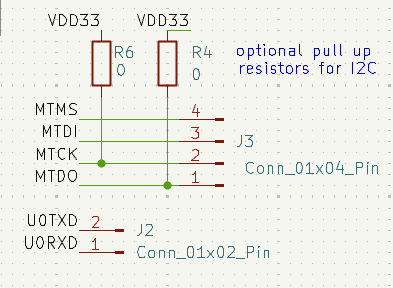

### Crystal Setup
The esp32 requires a `40MHz` crystal. We will be using the `ECS-400-10-37B2-CKY-TR` crystal. However, this part is not natively found in the KiCAD library. So we will have to import it from online. 

* A schematic symbol and footprint can be found on websites such as `www.snapeda.com` or `app.ultralibrarian.com`. Oftentimes, vendors such as Digi-Key will include a link to a parts model under `EDA/CAD Models` shown below:

  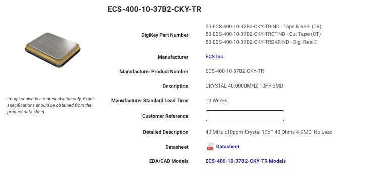

You may have to import CAD models for specific component in your teams projects. For this part, the following links will allow you to download a CAD model assuming that they are not deprecated.

* https://www.digikey.com/en/products/detail/ecs-inc/ECS-400-10-37B2-CKY-TR/14548829
* https://www.snapeda.com/parts/ECS-400-10-37B2-CKY-TR/ECS/view-part/?ref=digikey

Make sure to download a `2D Model` for `KiCAD (V6 or later)`.

  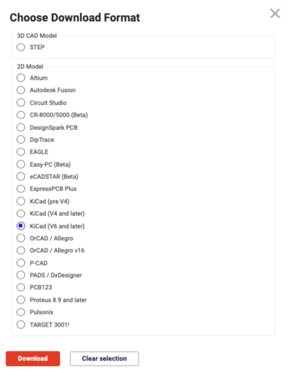

Once downloaded, open KiCad and in the top toolbar, click on `Symbol Editor`.

  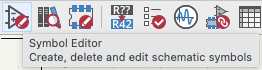

From there, search `Device`, left click on it, then go to `File > Import > Symbol`. This should open your file editor, go to the directory where you downloaded the ECAD model and select the file that ends with `.kicad_sym`. This should populate your symbol editor with the schematic model of the crystal. Make sure to save after this. Your symbol editor should look something like this:

  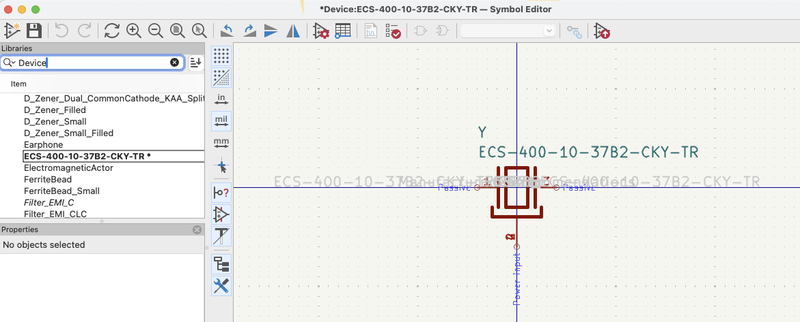

Now you can finish your schematic adding the following components:

* `ECS-400-10-37B2-CKY-TR`
* `C` for 10pF capacitors
Your final crystal schematic should look like this

  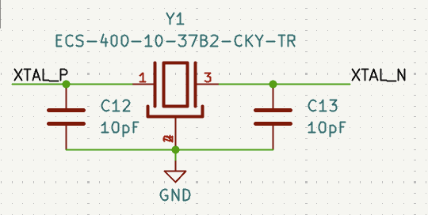

### Finalizing Schematics:
Before moving on to the next stage, we will clean up and document our schematic. Since screenshots of your schematics will go into your design document, you should put some effort into keeping them neat and easy to read. Use the graphic line tool to divide up your schematic, it is in the righthand toolbar or you can press `i` to draw graphical lines. Use the text tool to label each of these blocks.

  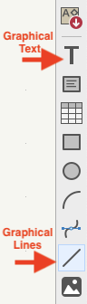

  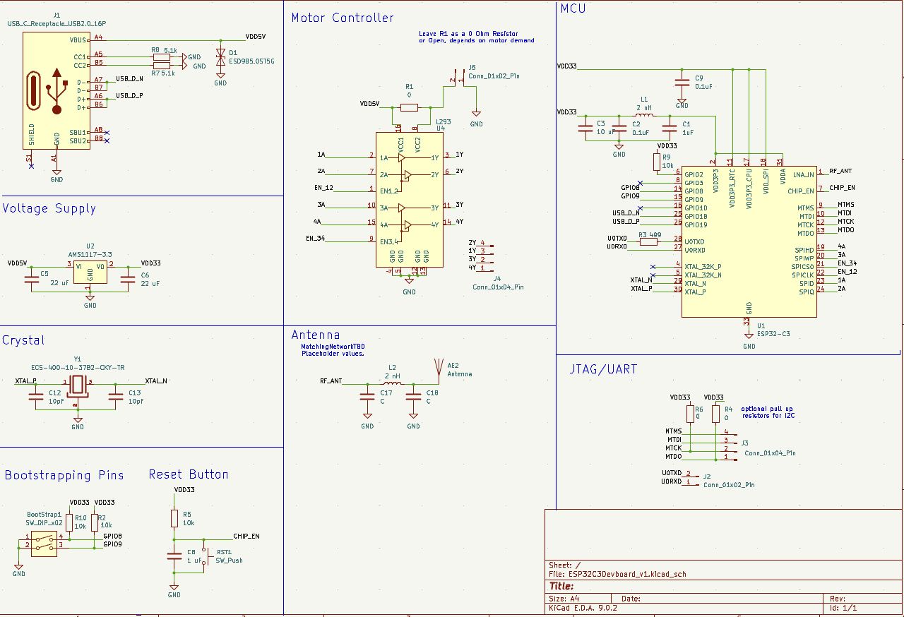

### Footprint Assignments
After defining the schematics, it's now time to assign physical footprints to each component. A footprint defines the area where a component will be mounted and soldered onto the board, ensuring proper electrical connections and mechanical attachment. It is a layout of pad, outlines, and markings on a PCB that matches the physical dimensions and pin configuration of a specific electronic component. Click on the footprint assigment tool in the the toolbar:

  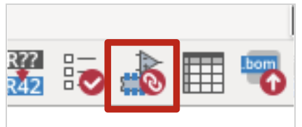

KiCAD will bring up the footprint association window, containing three panes. The left pane contains the categories of footprints, the middle pane contains your parts that need footprints assigned to them, and the right pane contains available footprints based on your filter options.

We'll start with the capacitors. We have 0805 sized capacitors that we will solder by hand, so double-click Capacitor_SMD:C_0805_..._HandSolder. Pay attention to the filter options at the top of the window.

Assignment the following components to the rest of the board:
* INCLUDE PARTS

## Layout Guide
Now we will switch to the physical layout of the board. From the schematic view, click on the following icon to switch views:

  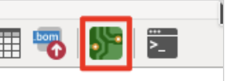

Start by clicking the "Update PCB with changes made to schematic" button and place the footprints somewhere in the middle of the page. If you make changes to your schematic later on, you should use this button.

  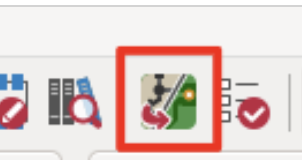

After initially pulling in footprints from your schematic, it should look something like this:

  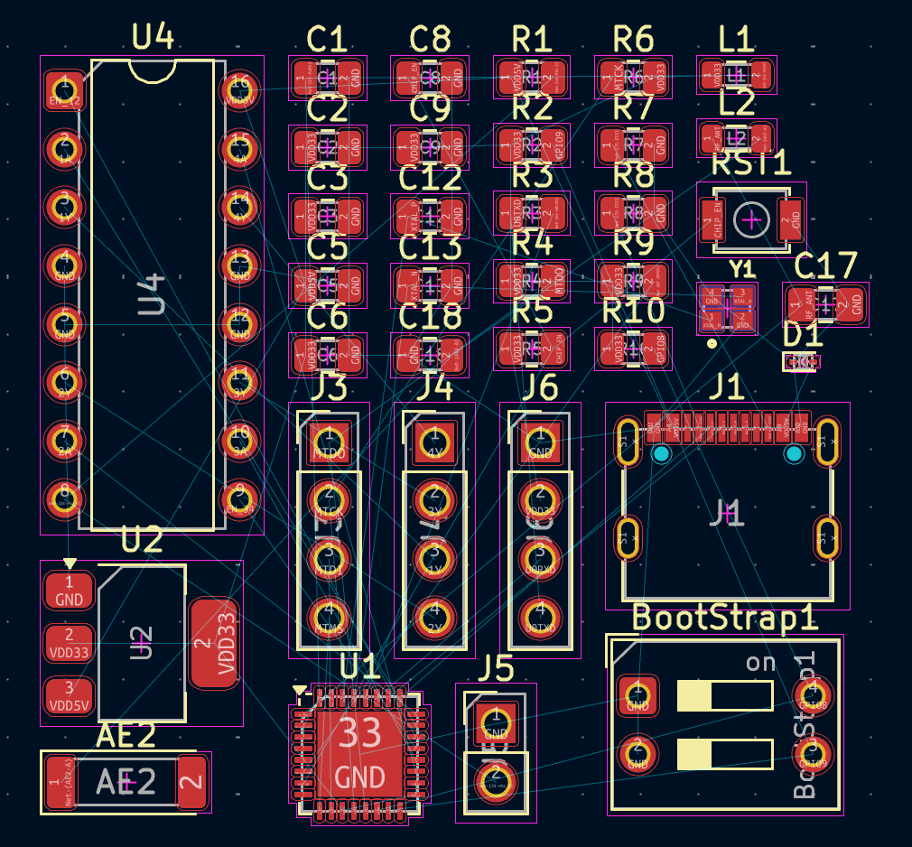

The blue lines are unrouted nets and indicatew what component pads are going to be connected together. To start, lets define the physical cutout of the PCB. You can do this by drawing a shape with "Edge.Cuts" selected in the toolbar. 

  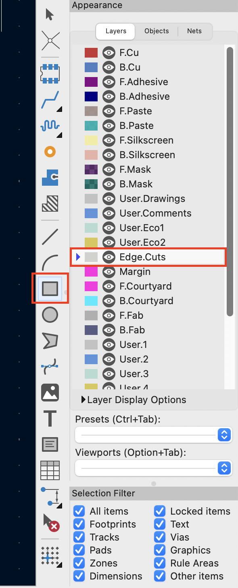

Drawing a rectangle of size `50mmx75mm`, your layout should look something like this:

  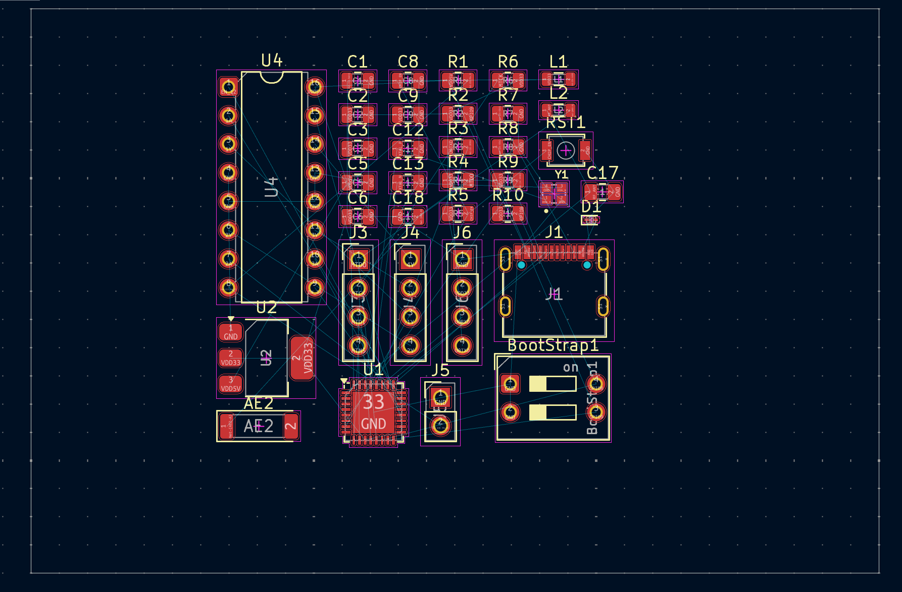

To make things a bit easier, we will add a ground plane to the front and back side of our board that will automatically connect all GND nets together for us. Any areas of filled in copper like this are known as zones in KiCAD. We can do so by selecting `F.Cu` and `"Draw Filled Zones"` in the toolbar

  

Define the front and back ground planes to match the dimensions of your edge cut layer so that your layout looks like this:

  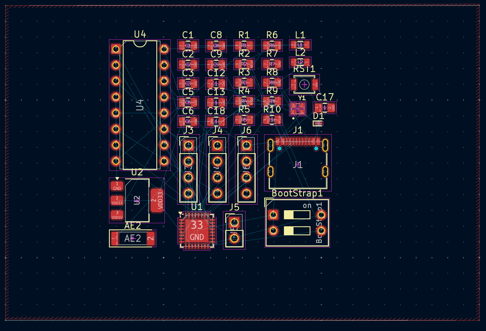

Now we can begin sorting the footprints. This is generally where most of the time designing a PCB should be spent. The goal here is to untangle the footprints so that airwires cross as little as possible. This makes routing in the next section simpler and helps to keep traces short. To save some time, below is a suggested layout for your board:

  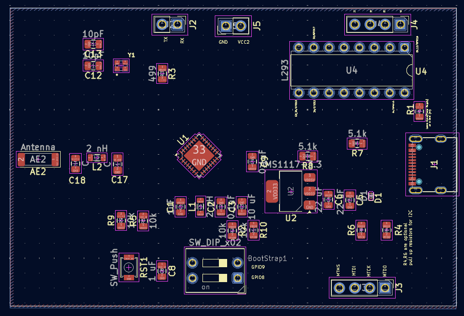

As a note, to rotate a footprint to 45 degrees, go to `Settings> PCB Editor > Editing Options` and change the value in the box labeled "Step for rotate commands" to 45.

  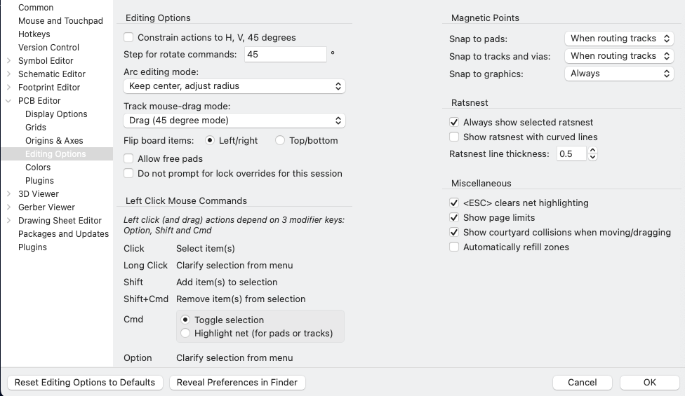

When you've placed all your components, make sure the component references are visible and not obscured by other footprints. You will use these references when populating the board.
## Routing:
The success of your routing is dependent on your project. Typically, traces that are high-speed, high-power, or highly parallel are prone to be more sensitive to layout than slower data lines or GPIO. You should identify and prioritze these first. In this particular board, we have the following critical traces

*`USB 2.0` data lines
*`RF 50 Ohm` trace for a `2.4GHz` antenna
* `40MHz` clock signal
* Power Traces

Most of the time, critical connections often adhere to some sort of standard. Otherwise, you can find routing specifications for components in a company's datasheet.  

To define traces, click the dropdown `Track: ... > Edit pre-defined sizes...` and add track widths for `7, 10, 15, 20, and 25 mils`. These larger tracks are used for the power traces.

Some useful shortcuts in KiCAD that you may use for routing are the following:

* `x` - Add tracks
* `v` - Toggle front/back side of board
* `u` - Select all segments of a track
* `Del` - Delete selected track segments
* `b` - redraw zones (after moving footprints or tracks)
* 
#### USB 2.0 Differential Traces
USB 2.0 defines a differential signaling pair, according to standard, the differential trace impedance needs to be `90 Ohm`. You should now define a differential pair with a width of `17mils` and a gap of `8 mils`. The differential impedance is dependent on the geometry of your traces as well as your physical stackup. These dimensions were chosen by using a trace impedance calculator that is available in KiCAD as well as other websites.

  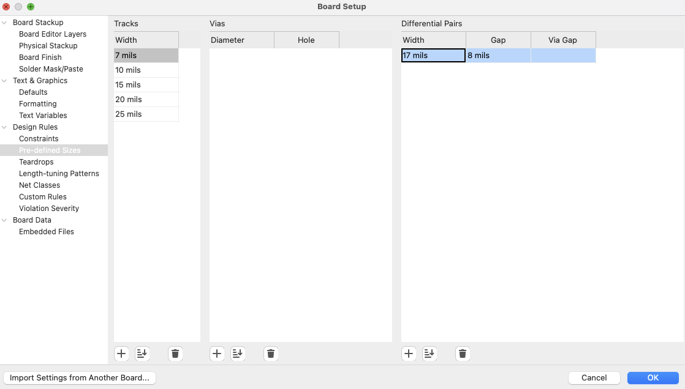

`6` initiates the process for routing differential pairs. Draw traces labeled `USB_D_P` and `USB_D_N` from the USB C connector to the ESP32.

Since USB is a differential signal, the physical length of each line should be equal. Given your routing, there may be some physical differences in length. To fix this, skew can be intentionally introduced in your routing. To do so, click on `Tools > Tune Skew of Differential Pair`. Your cursor hovering over the differential pair should indicate how much length mismatch there is:

  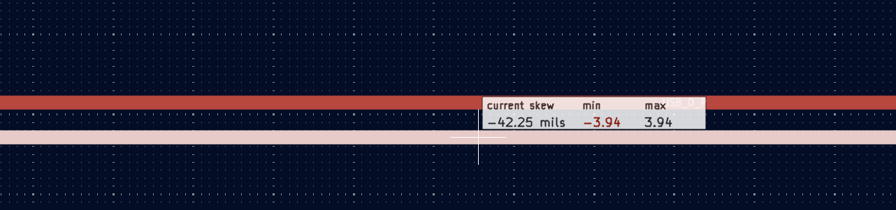

By clicking on one of the traces and bringing your cursor into empty space on the PCB, KiCAD will introduce a skew to make sure that the lengths of each trace are the same.

  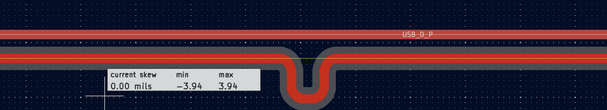

#### RF Trace
Select a width of `20mils` and add a track from pin 1 of the microcontroller through its matching network and to the antenna as shown below:

  

### Routing on the Backside
When routing a PCB, you will will need to route traces on the backside of the PCB since there is going to be crossing traces. To do so, you need two vias, which are electrically connected holes in the PCB. A simple example is shown below: 

  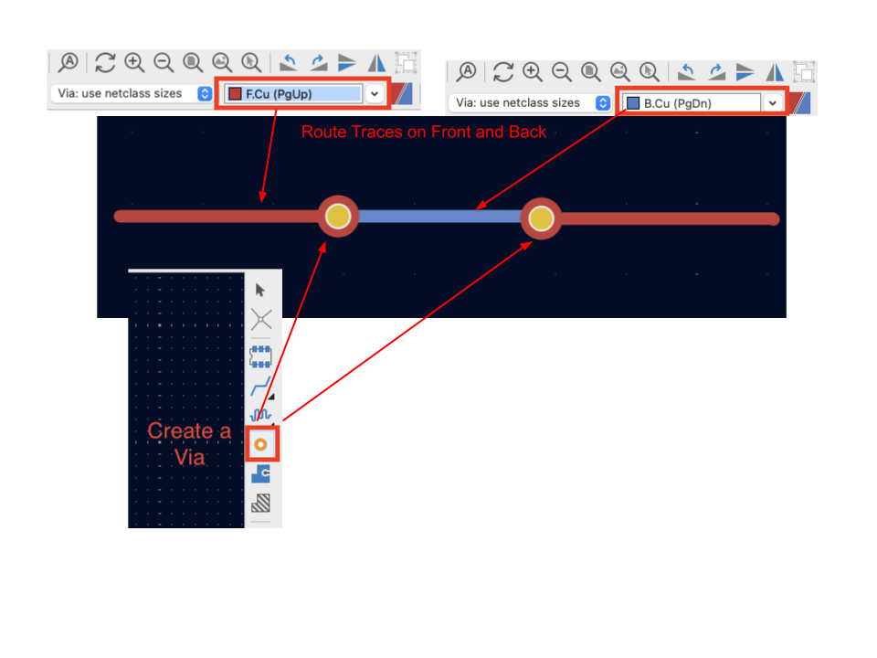

Continue routing the rest of the tracks. Use 20 mil tracks when connecting power traces to the regulator, and the regulator to the microcontroller. Otherwise, a `10mil` trace width for GPIO and other trace will be okay.

Before moving on, make sure your trace sizes match the following:
* USB 2.0: `7 mils`
* Power Traces (VDD33, 5V): `25 mils`
* RF Traces: `20mils`

You should also have some spacing between your data traces to mitigate cross talk. Generally, a separation of `2x` the trace width is good rule of thumb to follow.

### No Fill Zone
The antenna requires a no fill zone, where there will be no copper pour when the PCB is manufactured. To define a zone, click on the following in the toolbar.

  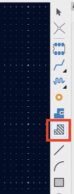

Use the following settings for the zone:

  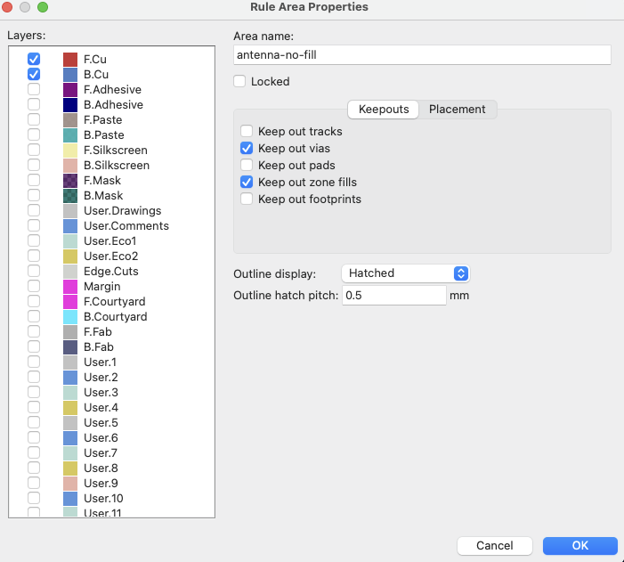

Define a no fill zone rectangle with dimensions of `10mmx75mm`. It should look like something below:

  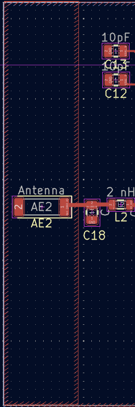

### Grounding
Press `b` to define a copper pour. This will fill the empty space with copper that acts as a GND signal plane for your circuit. Notice that in certain areas of the board there are discontinuities in the copper fill, resulting in `"copper islands"`. These can be problematic, however, they are easily solved by utilized a stitching via.

  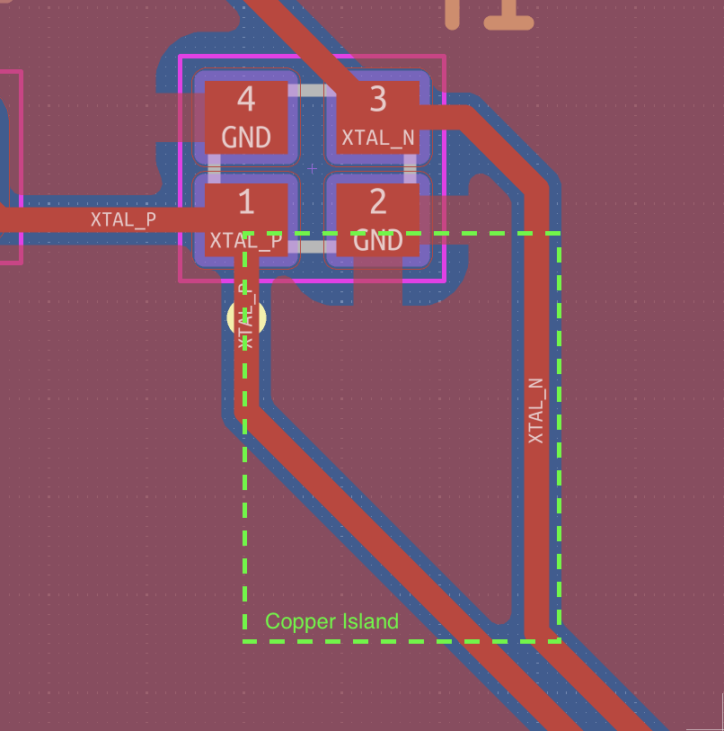

  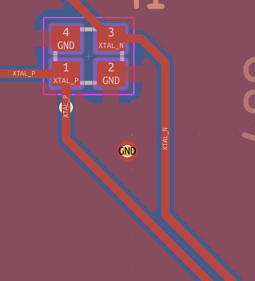

Place other stitching GNDs vias through your board to ensure a return path for your components throughout the board. The final board should look something like this:

  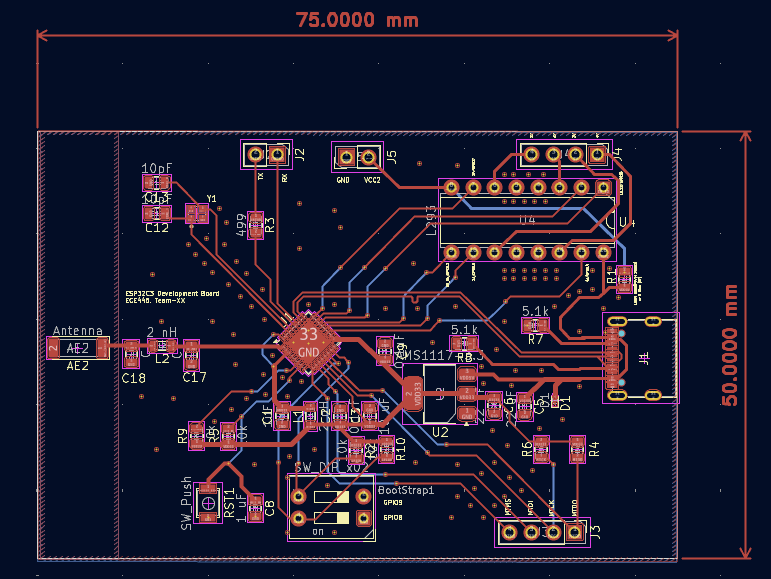

### Fabrication Outputs
Click `File > Fabrication Outputs > Gerbers .gbr`. Select an output directory, and click `Generate Drill Files` and then `Plot`. This will populate your selected directory with the necessary files that a manufacturer will need to create your board. Zip this folder and submit to your respective manufacturer.

#### Generating Custom Footprints and Symbols. 
Please refer to https://courses.grainger.illinois.edu/ece445/wiki/#/kicad/index?id=appendix if you would like to create custom footprints or symbols.

## Assembly Guide:

## Firmware Guide:
Download the Arduino IDE:
In boards manager, install the following package labeld "esp32" by Espressif Systems. At the time of this tutorial, version 3.2.0 was used.

  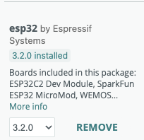

Before uploading a program, make sure your settings match those shown below:

  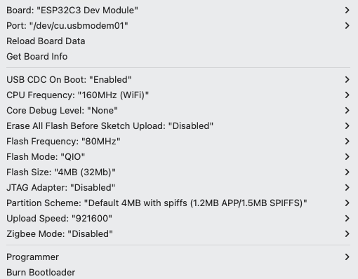

You can change your board by selecting "Board:" > "ESP32 Arduino (In sketchbook)" and selecting "ESP32C3 Dev Module"
The description under "Port: " May vary based on your computer. When plugging in your board into your computer, a new port should pop up, select that board for this program.
"USB CDC On Boot" should be enabled. This allows for serial connection over USB with the ESP32.

### Hello World Program
### Remainder of this Assignment:

